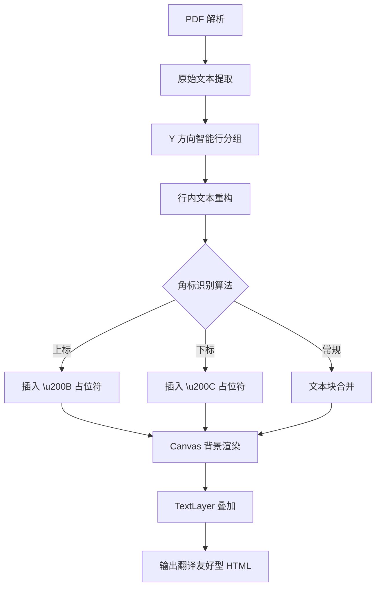

# 📄 PDFtranslate

**高质量 PDF 修复与浏览器翻译解决方案**

`PDFtranslate` 是一个纯前端、零依赖的 PDF 处理工具。它通过高保真的 **HTML 还原技术**，将复杂的 PDF 页面转换为可被浏览器翻译插件（如 Google Translate）完美识别的 HTML 结构，解决传统 PDF 翻译软件格式错乱、安装繁琐的问题。

## 🌟 核心特性

### 1. 高保真文本重构算法

* **智能行分组 (Y-Axis Grouping)**：基于字体大小与 Y 坐标的动态聚类算法，精准还原物理行结构。
* **三重角标检测**：通过字体缩放比、X 轴邻近度、Y 轴偏移量三维度识别，自动生成 `` 和 `` 标签。
* **非破坏性合并**：利用 **零宽字符占位符 (Zero-Width Characters)** 技术标记特殊格式，确保在不破坏 PDF 原始布局的前提下实现文本合并。
* **X 轴 Gap 截断**：自适应处理文本间距，防止类表格布局中的数据列错误合并。

### 2. 双图层混合渲染架构

* **Canvas 图像层**：基于 `Proxy API` 拦截绘制指令，仅渲染背景与非文字图形，消除文字重影。
* **TextLayer 文本层**：高精度透明文本覆盖，支持翻译插件抓取、自由选择与复制。

### 3. 参数化自适应系统

* 支持实时调节上/下角标比例阈值、X 轴合并倍数，适配不同排版风格的学术论文或商业报告。

## 🚀 快速上手

### 基本流程

1. **加载文件**：点击 **📂 上传 PDF** 按钮。
2. **渲染等待**：监控页面上方的进度状态，待显示 `✅ 修复完成`。
3. **开启翻译**：
* **Chrome / Edge**：右键点击页面 → 选择 **“翻译为中文”**。
* *注：不建议在 Firefox 中翻译，可能因其严格的 Prototype 检查导致报错。*

4. **保存成果**：
* 点击 **💾 导出 HTML**：获取一个包含所有图片和翻译后文字的单文件网页。
* 点击 **🖨️ 打印为 PDF**：使用系统打印对话框（`Ctrl+P`），目标选择“另存为 PDF”。

### 界面概览

## ⚙️ 技术实现

### 算法流程图

### 核心技术栈

* **渲染引擎**：[PDF.js](https://mozilla.github.io/pdf.js/) (Mozilla 开源)
* **逻辑控制**：原生 JavaScript (ES6+)
* **拦截模式**：JS Proxy API (实现透明文本过滤)

## ⚠️ 局限性与解决方案

| 限制问题 | 原因分析 | 推荐方案 |
| --- | --- | --- |
| **数学公式** | PDF.js 对复杂符号映射不全 | 建议在 HTML 导出后手动微调，或配合 MathJax |
| **翻译膨胀** | 翻译后文字变多，绝对定位导致重叠 | 调整侧边栏的“X轴阈值”，或手动修改元素的 `scaleX` |
| **Firefox 兼容** | 翻译插件触发非法原型调用错误 | 优先使用基于 Chromium 内核的浏览器 (Chrome/Edge/Brave) |

## ❤️ 支持与贡献

如果您觉得这个项目对您的文献阅读有所帮助，欢迎：

* **Star** 我们的 GitHub 仓库：[021gink/PDFtranslate](https://github.com/021gink/PDFtranslate)
* **提交 Issue**：反馈使用中遇到的复杂排版案例
* **捐赠支持**：点击工具栏的“捐赠作者”扫码支持

